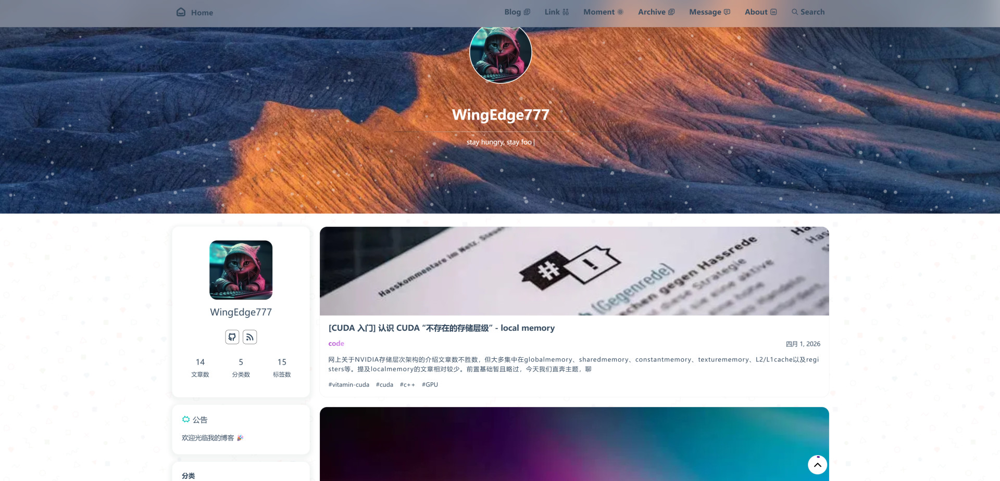

# WingEdge777's Blog

[中文版](README_cn.md)

Personal blog and astro theme based on [vhAstro-Theme](https://github.com/uxiaohan/vhAstro-Theme)

Blog Demo  ➡️ [https://www.wingedge777.com](https://www.wingedge777.com)

Lighthouse result:

## Modified Features

- [x] ToC sidebar
  - Added `Table of Content` sidebar into swup container, smoothingly show ToC and get permalink
- [x] Add github action config for easy deployment
  - Pernsonal server or github pages, depending on your choise.
- [x] Comment system
  - Kept twikoo only, rm waline
- [x] Astro managed assets, minimizes outputs size
  - Optimized: home-banner image size, speeds up page loadding
- [x] Add `permalink` for headerings
- [x] To add `i18n` pages
- [ ] To add `light/dark` mode

## i18n Guide

### UI copy

Edit locale dictionaries here:

- `src/i18n/dictionaries.ts`

This file controls site text such as:

- header nav
- search placeholder
- sidebar labels
- pagination text
- archive/category/tag page titles

### Blog content by locale

Default locale blog posts:

- `src/content/blog/**`

English blog posts:

- `src/content/blog-en/**`

Rules:

- Keep the same `id` for the same post across different languages
- `categories` and `tags` should match the target language
- English pages are generated under `/en/...`
- Default locale keeps raw permalink without locale prefix

Example:

- Chinese post: `src/content/blog/hpc/post-name.md`
- English post: `src/content/blog-en/hpc/post-name.md`

Generated URLs:

- default locale article: `/article/:id`
- english article: `/en/article/:id`

### Change default locale

Edit:

- `src/i18n/config.ts`

Important fields:

- `DEFAULT_LOCALE`
- `LOCALES`
- `LOCALE_SEGMENT`
- `BLOG_COLLECTION_BY_LOCALE`

Current setup:

- default locale: `zh-CN`
- default locale path prefix: `""`
- english path prefix: `"en"`

If you change the default locale, also check:

- `src/i18n/dictionaries.ts`
- `src/pages/**`
- `src/pages/en/**`

Because current routing strategy is:

- default locale uses existing raw routes
- secondary locale uses prefixed routes like `/en/...`

## Acknowledgment

Thanks to [vhAstro-Theme](https://github.com/uxiaohan/vhAstro-Theme) and its open source community
