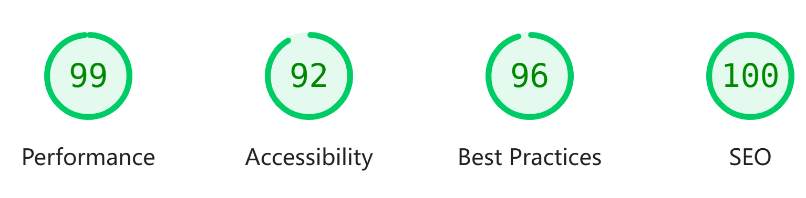

# WingEdge777's Blog

[English version](README.md)

基于 Astro 主题 [vhAstro-Theme](https://github.com/uxiaohan/vhAstro-Theme) 修改的博客主题，你也可以使用该主题搭建属于你自己的博客！

博客站点  ➡️ [https://www.wingedge777.com](https://www.wingedge777.com)，欢迎访问！

Lighthouse 评分：

## 基于原主题做的一些修改

- [x] 文章目录侧边栏
  - 在 Swup 容器中添加了「目录」侧边栏，平滑显示目录同时得以获取指定文章小节链接
- [x] 添加 GitHub Actions 配置以便轻松部署
  - 根据个人偏好选择部署到个人服务器或直接部署到 GitHub Pages，具体查看 yaml 文件
- [x] 评论系统
  - 仅保留 Twikoo，移除 Waline
- [x] 使用 Astro 管理静态资源，最小化输出体积
  - 已优化了首页横幅图片大小，加快页面加载速度
- [ ] 添加多语言支持
- [ ] 添加白天/暗黑主题

## 致谢

感谢[vhAstro-Theme](https://github.com/uxiaohan/vhAstro-Theme)主题项目及其开源社区，提供了优秀的网站模板给社区使用
