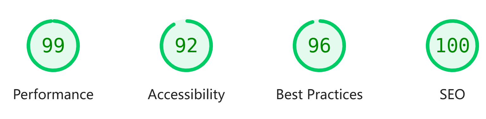

# WingEdge777's Blog

[English version](README.md)

基于 Astro 主题 [vhAstro-Theme](https://github.com/uxiaohan/vhAstro-Theme) 修改的博客主题，你也可以使用该主题搭建属于你自己的博客！

博客站点  ➡️ [https://www.wingedge777.com](https://www.wingedge777.com)，欢迎访问！

Lighthouse 评分：

## 基于原主题做的一些修改

- [x] 文章目录侧边栏
  - 在 Swup 容器中添加了「目录」侧边栏，平滑显示目录同时得以获取指定文章小节链接
- [x] 添加 GitHub Actions 配置以便轻松部署
  - 根据个人偏好选择部署到个人服务器或直接部署到 GitHub Pages，具体查看 yaml 文件
- [x] 评论系统
  - 仅保留 Twikoo，移除 Waline
- [x] 使用 Astro 管理静态资源，最小化输出体积
  - 已优化了首页横幅图片大小，加快页面加载速度
- [x] 添加多语言支持
- [ ] 添加白天/暗黑主题

## i18n 使用说明

### 站点文案

多语言文案统一维护在：

- `src/i18n/dictionaries.ts`

这里控制的内容包括：

- 顶部导航文案
- 搜索框占位文案
- 侧边栏文案
- 分页文案
- 归档页、分类页、标签页标题

### 不同语言的博客内容目录

默认语言博客目录：

- `src/content/blog/**`

英文博客目录：

- `src/content/blog-en/**`

约定：

- 同一篇文章在不同语言下必须保持相同 `id`
- `categories` 和 `tags` 应使用对应语言的值
- 英文页面生成在 `/en/...` 下
- 默认语言保持原始 permalink，不添加语言前缀

示例：

- 中文文章：`src/content/blog/hpc/post-name.md`
- 英文文章：`src/content/blog-en/hpc/post-name.md`

生成后的文章地址：

- 默认语言文章：`/article/:id`
- 英文文章：`/en/article/:id`

### 修改默认语言

编辑：

- `src/i18n/config.ts`

关键字段：

- `DEFAULT_LOCALE`
- `LOCALES`
- `LOCALE_SEGMENT`
- `BLOG_COLLECTION_BY_LOCALE`

当前配置：

- 默认语言：`zh-CN`
- 默认语言路径前缀：`""`
- 英文路径前缀：`"en"`

如果你修改默认语言，还需要同时检查：

- `src/i18n/dictionaries.ts`
- `src/pages/**`
- `src/pages/en/**`

因为当前路由策略是：

- 默认语言继续使用现有无前缀路由
- 次语言使用带前缀路由，例如 `/en/...`

## 致谢

感谢[vhAstro-Theme](https://github.com/uxiaohan/vhAstro-Theme)主题项目及其开源社区，提供了优秀的网站模板给社区使用
